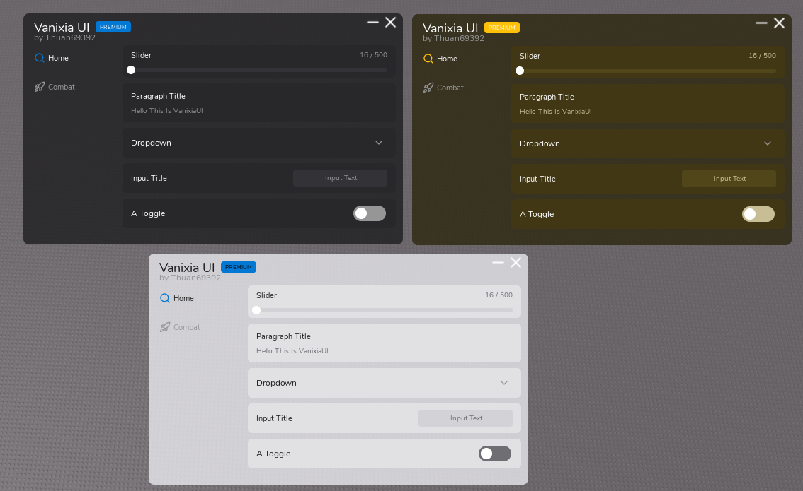
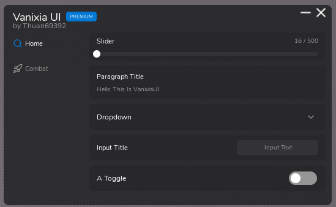
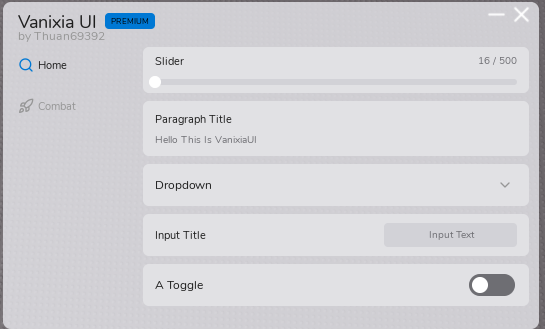
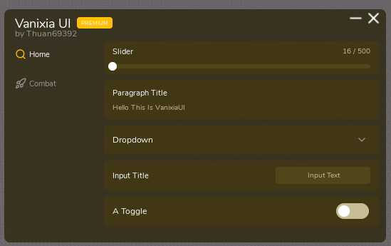

# VanixiaUI Library

VanixiaUI is a premium, lightweight, and responsive Object-Oriented User Interface (UI) Library designed for Roblox script developers. Built entirely in Luau, it offers an elegant Fluent-inspired aesthetic, seamless cross-tab navigation, custom animated window systems, dynamic section categories, and automated auto-sizing tags.

---

## Interface Themes

### All Themes

### Dark Theme

### Light Theme

### Yellow Theme

---

## 📖 Official Documentation

-> To create your own scripts using VanixiaUI, visit our official documentation website for the full API reference and examples:

**[https://thuan6565.github.io/Vanixian-UI-Library/](https://thuan6565.github.io/Vanixian-UI-Library/)**

### We will add more options in new Updates!, This is All of 1.0!
